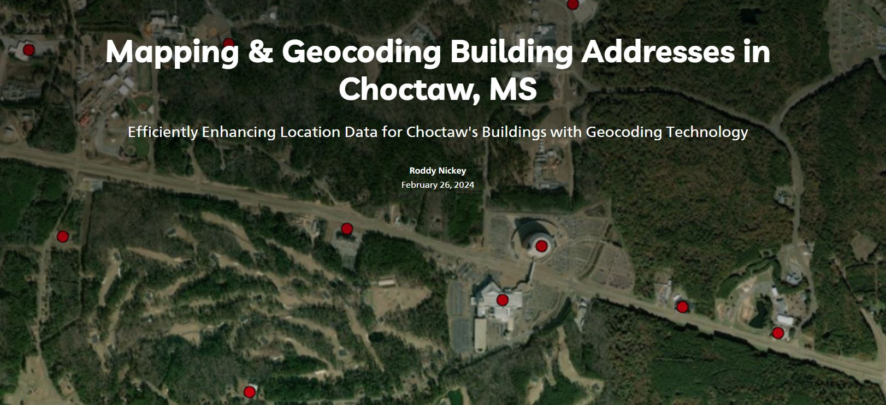

## Portfolio

---

**MBCI Real Estate**

County Parcel Maps are useful for property owners, real estate agents, surveyors, and government officials to determine ownership, boundaries, and other characteristics of land within a specific county.

---

**MBCI Location Map**

A Location Map showing Tribal Boundaries is a map that illustrates the geographic boundaries of tribal lands or territories belonging to Mississippi Band of Choctaw Indians. These maps are essential for showcasing the historical and current extent of tribal territories and are useful for tribal governments, researchers, government agencies, and organizations working with or on behalf of indigenous communities. They provide valuable information regarding the jurisdictional and territorial boundaries of a specific region or area.

---
**Topo Map - Choctaw, MS.**

Topo Map of Choctaw, MS is a detailed and accurate representation of the Earth's surface features. These maps use contour lines to show the shape and elevation of the land, providing information about the terrain, including hills, valleys, rivers, lakes, forests, and other physical features. Topographic maps are commonly used by hikers, backpackers, surveyors, land planners, and geologists to navigate terrain, plan outdoor activities, assess land for construction or development, and study natural landscapes. 

---
**Story Map**
- [Mapping and Geocoding Addresses in Choctaw, MS](https://storymaps.arcgis.com/stories/b7ad90c74f0d4426a9640af2917a9f49)
  
  

---
### University of Oklahoma School Projects

- [Google Engine Earth - Display Image Information Using Landsat1 ](https://code.earthengine.google.com/f79787f5ae2091bd99f512c2691b2c29)

---

Page template forked from <a href="https://github.com/evanca/quick-portfolio">evanca</a>

<!-- Remove above link if you don't want to attibute -->
